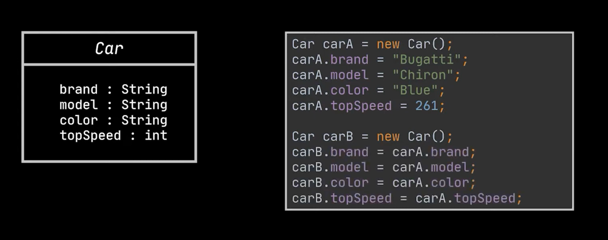
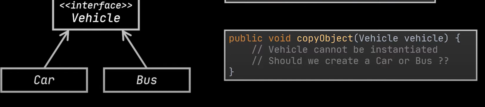
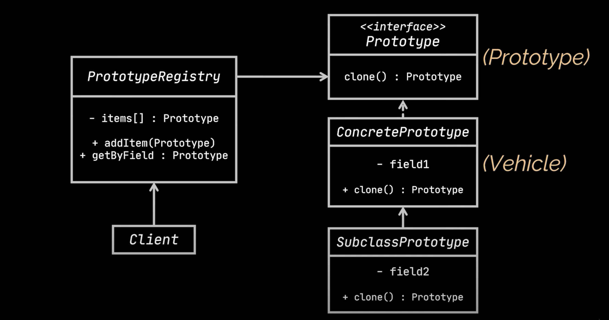

## About Prototype Design Pattern
*******
Suppose we have two objects of a class ,and we want to clone one object from another object. We can clone
it by referencing the attributes but what if some or all of the attributes are private.

Another challenge is what if there are two classes which are implementing a common interface ,and we know only
about interface ,but we have no details about each class implementing the interface. We may not be sure which 
class to clone. 

In such cases, we use prototype design pattern. We have an interface with clone method while the super class 
implementing the interface and the subclasses extending the superclass. The ideal solution is to have an 
abstract class which is having an abstract method clone and is implemented by its subclass. 

Lets take a look at working examples.